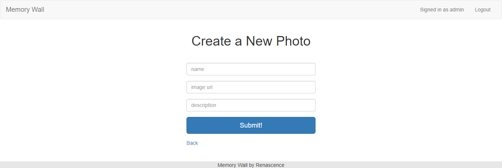
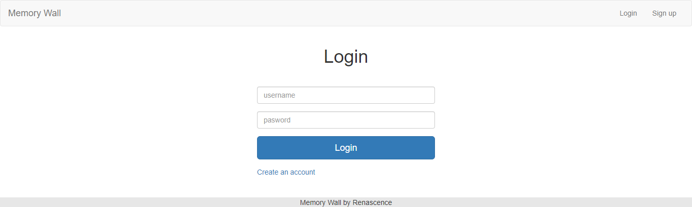

## Personal web project to sharing photos.

Tech Stack: 
* Node.js 
* Express.js 
* Bootstrap 
* MongoDB 

The user must log in first to add a new photo or comment. Only the owner of the photo can edit or delete the photo or comment 

**Landing page**
  
**Home page**
  
**Show photo and comments, just the owner can see the "Edit" and "Delete" buttons.**
  
**Create the new photo**
  
**Successfully added the new photo**
  
**Create the new commment**
  
**Successfully added the new comment, just the owner can see the "Edit" and "Delete" buttons.**
  
**Login**

